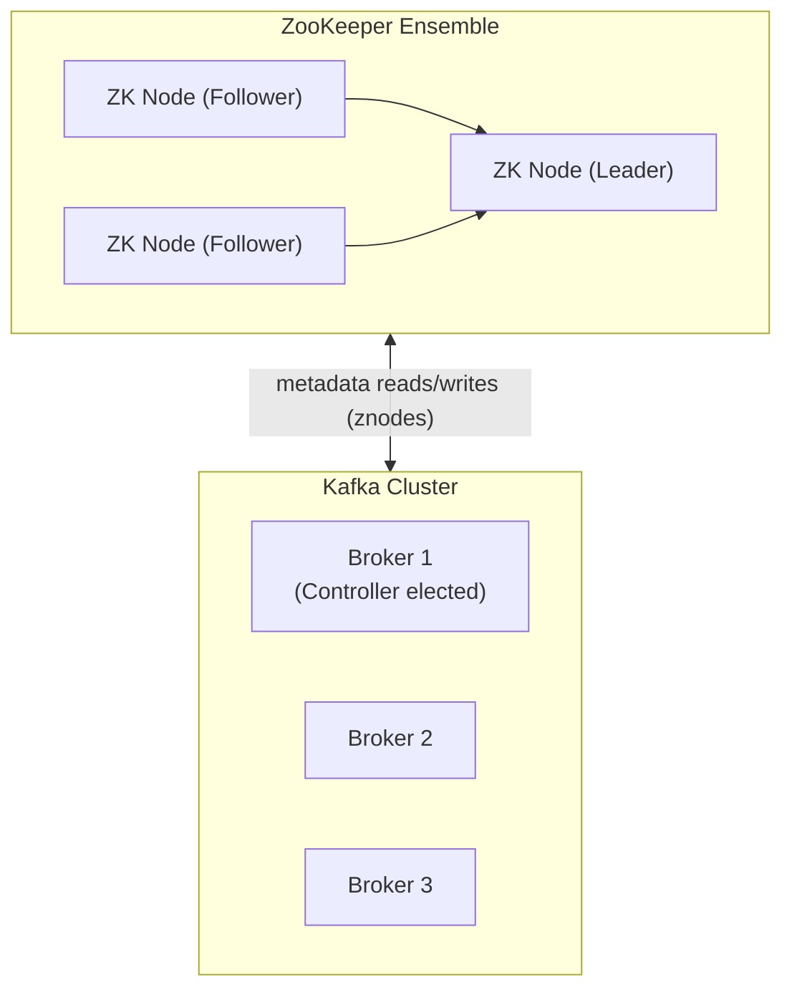
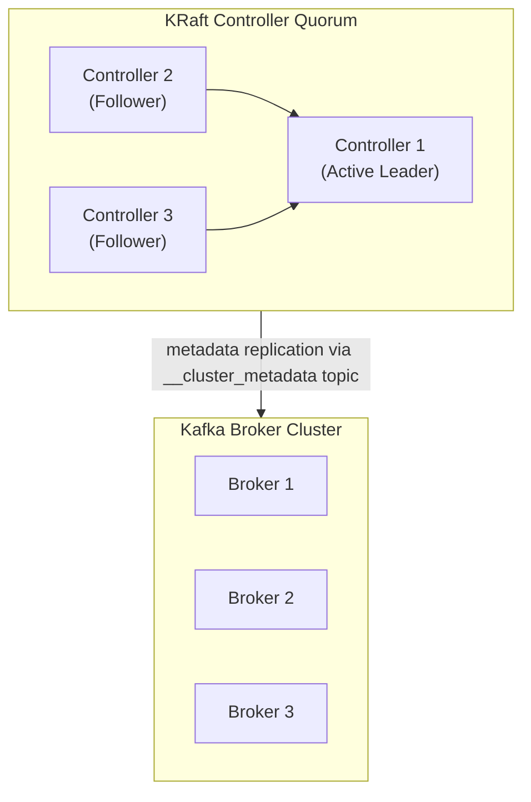

Every distributed system needs a reliable way to manage cluster metadata — which nodes are alive, who owns which partition, and what the current configuration is. For most of its history, Apache Kafka delegated this responsibility to **Apache ZooKeeper**, an external coordination service. With the introduction of **KRaft mode** (Kafka Raft Metadata), Kafka can now manage its own metadata natively, eliminating the ZooKeeper dependency entirely. Understanding the difference between these two approaches helps you make the right architectural decisions for your deployments.

<Warning>
  ZooKeeper mode is **deprecated as of Kafka 3.5** and will be removed in a future release. All new deployments should use KRaft mode. Existing ZooKeeper-based clusters should plan their migration.
</Warning>

## What Is ZooKeeper?

Apache ZooKeeper is a distributed coordination service — a separate open-source project that provides primitives like distributed locks, leader election, and a hierarchical key-value store. Kafka originally used ZooKeeper as its metadata backbone because building reliable distributed coordination from scratch is notoriously hard.

In a ZooKeeper-mode Kafka deployment, ZooKeeper is responsible for:

- **Broker registration** — each broker registers itself as an ephemeral ZooKeeper node on startup. If a broker crashes, its node disappears and ZooKeeper notifies the cluster.
- **Controller election** — the Kafka controller broker is elected via a ZooKeeper leader election race.
- **Topic and partition metadata** — partition assignments, leader information, and replica lists are stored in ZooKeeper's znodes.
- **Consumer group coordination** — in older Kafka clients, consumer group offsets were stored in ZooKeeper (this moved to Kafka itself in Kafka 0.9).
- **ACL and configuration storage** — topic-level configuration overrides and security ACLs are stored in ZooKeeper.

## ZooKeeper Architecture in Kafka

ZooKeeper itself is deployed as an **ensemble** — a cluster of ZooKeeper nodes that use the ZAB (ZooKeeper Atomic Broadcast) protocol for consensus. A typical ZooKeeper ensemble has 3 or 5 nodes; a majority (quorum) must be available for ZooKeeper to be operational.



Kafka brokers connect to ZooKeeper at startup and maintain a persistent session. Producers and consumers connect only to Kafka brokers — they never talk to ZooKeeper directly (in modern client versions).

## Limitations of ZooKeeper

While ZooKeeper served Kafka well for over a decade, it introduced real operational and architectural constraints as Kafka usage scaled.

<Accordion title="Operational complexity">
  Running ZooKeeper means operating two separate distributed systems instead of one. ZooKeeper has its own versioning, configuration, monitoring, backup, and upgrade lifecycle — completely independent of Kafka. This doubles the operational surface area for platform teams.
</Accordion>

<Accordion title="Scalability bottleneck">
  ZooKeeper stores all partition metadata in memory. As the number of partitions in a cluster grows into the hundreds of thousands, ZooKeeper's memory footprint and write throughput become limiting factors. Benchmarks have shown ZooKeeper-based Kafka clusters struggling beyond ~200,000 partitions in a single cluster.
</Accordion>

<Accordion title="Slow controller failover">
  When the Kafka controller fails, the new controller must reload all metadata from ZooKeeper. In a large cluster with many topics and partitions, this can take tens of seconds — during which partition leadership elections are stalled and the cluster is partially degraded.
</Accordion>

<Accordion title="Metadata consistency lag">
  ZooKeeper and Kafka maintain separate copies of cluster metadata. Keeping them synchronized introduces a layer of complexity and occasional consistency windows where the two systems momentarily disagree.
</Accordion>

## What Is KRaft Mode?

**KRaft** (Kafka Raft) mode is Kafka's built-in metadata management system, introduced via [KIP-500](https://cwiki.apache.org/confluence/display/KAFKA/KIP-500%3A+Replace+ZooKeeper+with+a+Self-Managed+Metadata+Quorum). It replaces ZooKeeper with a **Raft-based consensus protocol** implemented natively inside Kafka itself.

In KRaft mode, a subset of brokers are designated as **controllers** and form a **controller quorum**. This quorum uses the Raft algorithm to elect an **active controller** among themselves and replicate all cluster metadata to a special internal topic: **`__cluster_metadata`**. Because metadata is stored as a Kafka log, it benefits from the same durability, replication, and performance properties as your regular topics.

Key improvements over ZooKeeper mode:

- **Single system to operate** — no external ZooKeeper ensemble required
- **Faster controller failover** — the new active controller already has all metadata locally; failover completes in milliseconds
- **Higher partition scale** — tested to support millions of partitions per cluster
- **Simpler security** — one set of SSL/TLS and authentication configurations instead of two

## KRaft Architecture

In KRaft mode, every node has a **process role**: `broker`, `controller`, or `broker,controller` (combined).



<Note>
  For smaller clusters, brokers and controllers can run on the same nodes using the combined `broker,controller` `process.role` setting.
</Note>

A controller quorum of **3 nodes** tolerates 1 failure; a quorum of **5 nodes** tolerates 2 failures. For production, a dedicated quorum of 3 controllers (separate from your broker nodes) is the recommended topology.

## KRaft vs ZooKeeper: Feature Comparison

| Feature | ZooKeeper Mode | KRaft Mode |
| --- | --- | --- |
| **Available Since** | Kafka 0.x (original) | Kafka 2.8 (preview), 3.3 (production-ready) |
| **Metadata Store** | Apache ZooKeeper (external) | `__cluster_metadata` Kafka topic (internal) |
| **Max Partitions (tested)** | ~200,000 per cluster | Millions per cluster |
| **Operational Complexity** | High — two systems to manage | Low — single system |
| **Controller Election** | ZooKeeper ephemeral node race | Raft leader election |
| **Controller Failover Time** | Seconds to minutes (metadata reload) | Milliseconds |
| **Deployment Complexity** | Requires ZooKeeper ensemble | No external dependency |
| **Recommended For** | Legacy / migration path only | All new deployments |

## Enabling KRaft Mode

To run a broker in KRaft mode, you need to make a few changes to `server.properties` and generate a unique cluster ID.

<Steps>
  <Step title="Generate a unique cluster ID">
    Every KRaft cluster requires a unique UUID that is used to identify the cluster metadata log. Generate one using the Kafka CLI.

    ```bash title="Generate cluster ID"
    kafka-storage.sh random-uuid
    # Example output: xtzWWN4bTjitpL3kfd9s5g
    ```
  </Step>
  <Step title="Configure server.properties">
    Update your broker's configuration file to specify the KRaft-specific settings.

    ```properties title="server.properties — KRaft broker+controller (single-node or small cluster)"
    # The unique broker/node ID (must be unique per node)
    node.id=1
    
    # This node acts as both a broker and a controller
    process.roles=broker,controller
    
    # The controller quorum — list all controller nodes (nodeId@host:port)
    controller.quorum.voters=1@localhost:9093,2@localhost:9093,3@localhost:9093
    
    # Listeners for broker traffic and controller traffic
    listeners=PLAINTEXT://localhost:9092,CONTROLLER://localhost:9093
    advertised.listeners=PLAINTEXT://localhost:9092
    
    # Map listener names to security protocols
    listener.security.protocol.map=CONTROLLER:PLAINTEXT,PLAINTEXT:PLAINTEXT
    
    # The listener used for inter-controller communication
    controller.listener.names=CONTROLLER
    
    # Where to store the log data
    log.dirs=/var/kafka/data
    ```
  </Step>
  <Step title="Format the storage directory">
    Before starting the broker for the first time, you must format the log directory with the cluster ID you generated in step 1.

    ```bash title="Format storage with cluster ID"
    kafka-storage.sh format \
      --config /etc/kafka/server.properties \
      --cluster-id xtzWWN4bTjitpL3kfd9s5g
    ```
  </Step>
  <Step title="Start the broker">
    Start Kafka as normal. No ZooKeeper process is needed.

    ```bash title="Start Kafka in KRaft mode"
    kafka-server-start.sh /etc/kafka/server.properties
    ```
  </Step>
</Steps>

## Migrating from ZooKeeper to KRaft

If you have an existing ZooKeeper-based Kafka cluster, Apache Kafka provides an official migration path starting with Kafka 3.6. The migration is a rolling process that does not require downtime.

The high-level migration steps are:

1. Upgrade all brokers to Kafka 3.6 or later while still running in ZooKeeper mode.
2. Deploy a KRaft controller quorum alongside your existing cluster.
3. Run the migration tool to transfer metadata from ZooKeeper to the KRaft controllers.
4. Switch each broker to KRaft mode with a rolling restart.
5. Decommission ZooKeeper once all brokers have migrated.

<Card title="Official ZooKeeper to KRaft Migration Guide" icon="book" href="https://kafka.apache.org/documentation/#kraft_zk_migration">
  Refer to the official Apache Kafka documentation for the complete, version-specific migration instructions and any caveats for your Kafka version.
</Card>

<Note>
  The migration process is designed to be **reversible** in its early stages — you can roll back to ZooKeeper mode if you encounter problems before completing the migration. Once you have fully committed and decommissioned ZooKeeper, rollback is no longer possible.
</Note>