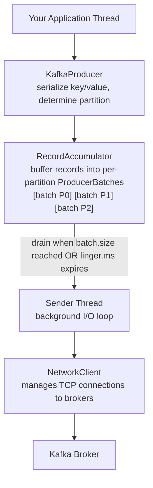

Kafka producers are more sophisticated than they first appear. Behind a simple `producer.send()` call lies a multi-threaded pipeline that batches records, compresses payloads, manages retries, and — when configured correctly — guarantees that every message is delivered exactly once. Understanding these internals helps you tune throughput, reduce latency, and reason about failure scenarios before they hit production.

## The Producer Internals

When you call `producer.send()`, the record does not immediately travel over the network. Instead it passes through several internal components before it leaves the JVM.



<AccordionGroup>
  <Accordion title="RecordAccumulator">
    The accumulator is a per-partition buffer. Every time you send a record, it is appended to the current `ProducerBatch` for that partition. Once a batch reaches `batch.size` bytes it is marked ready for the Sender thread to drain. If `linger.ms` is greater than zero, the accumulator will wait that many milliseconds before declaring a batch ready — even if it has not reached `batch.size`. This waiting period allows more records to accumulate, producing fewer, larger requests.
  </Accordion>

  <Accordion title="Sender Thread">
    The Sender runs in a background daemon thread. It continuously polls the accumulator for ready batches, groups them by leader broker, and hands them to the `NetworkClient` as `ProduceRequest` messages. The Sender is also responsible for processing acknowledgements and triggering retries on transient errors.
  </Accordion>

  <Accordion title="NetworkClient">
    The `NetworkClient` wraps the Java NIO selector and maintains a pool of persistent TCP connections — one per broker. It serialises `ProduceRequest` objects to bytes, writes them to the socket, and reads `ProduceResponse` objects back, correlating them with in-flight requests via a request ID.
  </Accordion>

  <Accordion title="ProducerBatch">
    A `ProducerBatch` is a pre-allocated `ByteBuffer` that accumulates compressed record data alongside the metadata needed to fire callbacks once the broker acknowledges the batch. Reusing buffers (via the `BufferPool`) avoids GC pressure under high throughput.
  </Accordion>
</AccordionGroup>

## Message Batching

Batching is the single biggest lever for improving producer throughput. Instead of sending one TCP request per record, the producer aggregates many records into a single network call.

Two configuration parameters control batching behaviour:

| Parameter | Default | Purpose |
| --- | --- | --- |
| `batch.size` | `16384` (16 KB) | Maximum size in bytes of a single batch |
| `linger.ms` | `0` | How long to wait for a batch to fill before sending |

With `linger.ms=0` (the default), batches are sent as soon as the Sender thread wakes up — which is almost immediately. This minimises latency but sacrifices throughput because batches are often sent nearly empty.

<Tip>
  For high-throughput use cases set `linger.ms` to somewhere between **5 ms and 20 ms**. This small delay allows many records to accumulate in the same batch, dramatically increasing the bytes-per-request ratio without adding noticeable end-to-end latency for most applications.
</Tip>

You can also increase `batch.size` (e.g. to 64 KB or 128 KB) when records are large or the send rate is very high. The two settings work together: a batch is sent when either it reaches `batch.size` bytes **or** `linger.ms` expires — whichever comes first.

```java title="BatchingProducer.java"
Properties props = new Properties();
props.put(ProducerConfig.BOOTSTRAP_SERVERS_CONFIG, "localhost:9092");
props.put(ProducerConfig.KEY_SERIALIZER_CLASS_CONFIG, StringSerializer.class.getName());
props.put(ProducerConfig.VALUE_SERIALIZER_CLASS_CONFIG, StringSerializer.class.getName());

// Increase batch size to 64 KB
props.put(ProducerConfig.BATCH_SIZE_CONFIG, 64 * 1024);

// Wait up to 10 ms for the batch to fill
props.put(ProducerConfig.LINGER_MS_CONFIG, 10);

// Increase in-flight buffer to 64 MB
props.put(ProducerConfig.BUFFER_MEMORY_CONFIG, 64 * 1024 * 1024L);

KafkaProducer<String, String> producer = new KafkaProducer<>(props);
```

## Compression

Compression reduces the bytes on the wire and the bytes stored on disk. Because Kafka compresses an entire batch as a single unit, larger batches yield better compression ratios. The `compression.type` producer config accepts one of five values.

| Algorithm | CPU Cost | Compression Ratio | Latency | Best For |
| --- | --- | --- | --- | --- |
| `none` | None | 1× (no reduction) | Lowest | Debugging, already-compressed payloads |
| `gzip` | High | Excellent (~5×) | Higher | Low-volume, storage-sensitive pipelines |
| `snappy` | Low | Good (~2–3×) | Low | General purpose, balanced workloads |
| `lz4` | Very low | Good (~2–3×) | Very low | Latency-sensitive, high-throughput |
| `zstd` | Medium | Excellent (~4–5×) | Low–medium | Best overall ratio-to-CPU tradeoff (Kafka ≥ 2.1) |

<Note>
  Compression is applied by the **producer** and decompressed by the **consumer**. Brokers store the compressed batch as-is, which means your storage costs also benefit. `zstd` is the recommended default for most new pipelines on Kafka 2.1\+.
</Note>

```java title="CompressedProducer.java"
props.put(ProducerConfig.COMPRESSION_TYPE_CONFIG, "zstd");
```

## Partitioning Strategies

By default the producer uses a sticky partitioner that fills one batch at a time before moving to the next partition — maximising batch size. You can override this by supplying a custom `Partitioner` implementation.

```java title="PriorityPartitioner.java"
import org.apache.kafka.clients.producer.Partitioner;
import org.apache.kafka.common.Cluster;
import java.util.Map;

/**
 * Routes records with key "HIGH" to partition 0,
 * everything else is distributed round-robin across the remaining partitions.
 */
public class PriorityPartitioner implements Partitioner {

    @Override
    public int partition(String topic, Object key, byte[] keyBytes,
                         Object value, byte[] valueBytes, Cluster cluster) {
        int numPartitions = cluster.partitionCountForTopic(topic);
        if (keyBytes != null && "HIGH".equals(key.toString())) {
            return 0; // dedicated high-priority partition
        }
        // Distribute remaining records across partitions 1..N-1
        return (Math.abs(key.hashCode()) % (numPartitions - 1)) + 1;
    }

    @Override
    public void close() {}

    @Override
    public void configure(Map<String, ?> configs) {}
}
```

Register your partitioner in the producer config:

```java title="ProducerWithCustomPartitioner.java"
props.put(ProducerConfig.PARTITIONER_CLASS_CONFIG, PriorityPartitioner.class.getName());
```

## Delivery Guarantees

Kafka producers support three delivery semantics, controlled by the `acks` configuration and retry behaviour.

<Tabs>
  <Tab title="At-Most-Once">
    **`acks=0`** — The producer fires and forgets. No acknowledgement is requested. Records can be lost if the broker is unavailable or the leader fails before writing to disk.

    ```java
    props.put(ProducerConfig.ACKS_CONFIG, "0");
    props.put(ProducerConfig.RETRIES_CONFIG, 0);
    ```

    Use this only when losing some messages is acceptable, such as non-critical metrics or heartbeat events.
  </Tab>
  <Tab title="At-Least-Once">
    **`acks=all` \+ retries** — The leader waits for all in-sync replicas to acknowledge the write. If a network error occurs, the producer retries, potentially producing duplicate records.

    ```java
    props.put(ProducerConfig.ACKS_CONFIG, "all");
    props.put(ProducerConfig.RETRIES_CONFIG, Integer.MAX_VALUE);
    props.put(ProducerConfig.MAX_IN_FLIGHT_REQUESTS_PER_CONNECTION, 5);
    ```

    This is the most common setting. Your consumer logic must be idempotent to handle duplicates safely.
  </Tab>
  <Tab title="Exactly-Once">
    **`enable.idempotence=true`** (which implies `acks=all`) — Combines broker-side deduplication with producer sequence numbers so that retries never produce duplicates. For cross-topic atomicity, use Kafka transactions.

    ```java
    props.put(ProducerConfig.ENABLE_IDEMPOTENCE_CONFIG, true);
    props.put(ProducerConfig.TRANSACTIONAL_ID_CONFIG, "my-transactional-id");
    ```
  </Tab>
</Tabs>

## Idempotent Producer

Enabling idempotence tells Kafka to deduplicate records on the broker side. When you set `enable.idempotence=true`, the broker assigns the producer a **Producer ID (PID)** and tracks a monotonically increasing **sequence number** per partition.

```mermaid
sequenceDiagram
    participant P as Producer
    participant B as Broker
    P->>B: ProduceRequest (PID=42, seq=1)
    Note right of B: Write record, remember seq=1
    B-->>P: Ack
    P->>B: ProduceRequest (PID=42, seq=2)
    Note right of B: Network timeout; producer retries
    P->>B: ProduceRequest (PID=42, seq=2)
    Note right of B: Duplicate! seq=2 already seen, DISCARD
    B-->>P: Ack
```

If the broker receives a batch with a sequence number it has already written for that PID \+ partition combination, it silently discards the duplicate and returns a success response. This mechanism is transparent to your application code.

```java title="IdempotentProducer.java"
props.put(ProducerConfig.ENABLE_IDEMPOTENCE_CONFIG, true);
// acks=all and retries=MAX_VALUE are set automatically
// max.in.flight.requests.per.connection is capped at 5 automatically
```

<Note>
  Idempotence covers a single producer session. If the producer process restarts and gets a new PID, the broker cannot detect duplicates across the restart boundary. For that level of guarantee you need transactions with a stable `transactional.id`.
</Note>

## Transactions

Kafka transactions allow you to atomically write to **multiple topics and partitions** in a single all-or-nothing operation. This is the foundation of exactly-once semantics (EOS) in stream processing.

<Warning>
  Transactions require both `acks=all` and `enable.idempotence=true`. Setting `transactional.id` implies both of these automatically, but you must provide a **unique, stable** transactional ID per producer instance to prevent fencing conflicts.
</Warning>

<Steps>
  <Step title="Configure the transactional producer">
    ```java title="TransactionalProducerConfig.java"
    Properties props = new Properties();
    props.put(ProducerConfig.BOOTSTRAP_SERVERS_CONFIG, "localhost:9092");
    props.put(ProducerConfig.KEY_SERIALIZER_CLASS_CONFIG, StringSerializer.class.getName());
    props.put(ProducerConfig.VALUE_SERIALIZER_CLASS_CONFIG, StringSerializer.class.getName());
    props.put(ProducerConfig.TRANSACTIONAL_ID_CONFIG, "order-producer-1");
    // enable.idempotence and acks=all are implied
    ```
  </Step>
  <Step title="Initialise and use transactions">
    ```java title="TransactionalProducer.java"
    KafkaProducer<String, String> producer = new KafkaProducer<>(props);
    
    producer.initTransactions(); // registers with the transaction coordinator
    
    try {
        producer.beginTransaction();
    
        producer.send(new ProducerRecord<>("orders", key, value));
        producer.send(new ProducerRecord<>("inventory", key, updateValue));
    
        producer.commitTransaction(); // atomic commit across both topics
    } catch (ProducerFencedException e) {
        // Another producer with the same transactional.id took over
        producer.close();
    } catch (KafkaException e) {
        // Transient error — abort so consumers never see partial state
        producer.abortTransaction();
    }
    ```
  </Step>
</Steps>

When you call `commitTransaction()`, the broker marks the transaction as committed in a special `__transaction_state` internal topic. Consumers configured with `isolation.level=read_committed` will only see records from committed transactions, so partial writes from aborted transactions are invisible to them.

## Producer Metrics

Monitoring your producer is essential for diagnosing throughput and reliability issues. These are the most important JMX metrics exposed by the Kafka producer client.

| Metric | MBean Attribute | What It Tells You |
| --- | --- | --- |
| `record-send-rate` | `kafka.producer:type=producer-metrics` | Records sent per second; tracks throughput |
| `record-error-rate` | `kafka.producer:type=producer-metrics` | Failed sends per second; should be near zero |
| `request-latency-avg` | `kafka.producer:type=producer-metrics` | Average round-trip time (ms) for a produce request |
| `batch-size-avg` | `kafka.producer:type=producer-metrics` | Average batch size in bytes; low value = batching not effective |
| `compression-rate-avg` | `kafka.producer:type=producer-metrics` | Ratio of compressed to uncompressed size; lower = better |
| `records-per-request-avg` | `kafka.producer:type=producer-metrics` | Average records per batch; higher = more efficient |

```java title="MetricsExample.java"
// Access metrics programmatically
Map<MetricName, ? extends Metric> metrics = producer.metrics();
metrics.forEach((name, metric) -> {
    if (name.name().equals("record-send-rate")) {
        System.out.printf("Send rate: %.2f records/sec%n", (Double) metric.metricValue());
    }
});
```